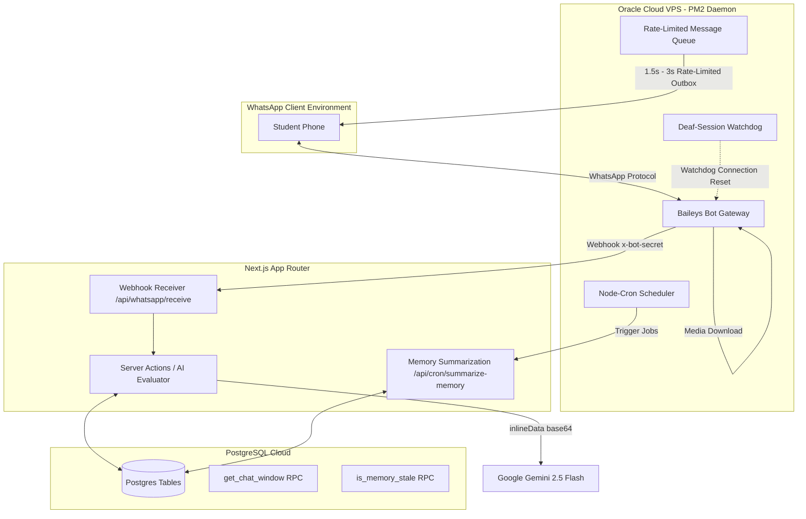

# LoopLearn: AI-Powered Adaptive Learning & WhatsApp Homework Tutor

LoopLearn is a modern, closed-loop educational platform designed to reverse the forgetting curve through spaced repetition, interactive quiz interfaces, and a production-grade **WhatsApp AI Tutor bot**. Powered by Google Gemini 2.5 Flash and Supabase (PostgreSQL), the system evaluates student submissions, guides learning via a personalized three-tier memory architecture, and automates homework tracking for teachers.

---

## 🏗️ System Architecture

LoopLearn is built as a high-performance monorepo comprised of two core services:



1. **Frontend & Backend Orchestrator (`looplearn-next`)**: Built with **Next.js 15 (App Router)** and **React 19**, styled using **Tailwind CSS**. Deployed on **Vercel**, it hosts the teacher's management hub and processes webhook payloads using Next.js Server Actions.
2. **WhatsApp Bot Gateway (`looplearn-whatsapp-bot`)**: A Node.js daemon built on **Baileys (WA Multi-Device API)**. Deployed on an **Oracle VPS** and managed via **PM2**, it maintains the WhatsApp WebSocket connection, streams files, and queues outbox notifications.

---

## 🧠 Three-Tier AI Tutor Memory System

To deliver personalized, context-aware tutoring on WhatsApp, LoopLearn implements a custom three-tier memory framework integrated directly into the Gemini LLM pipeline. This system prevents context drift and mitigates latency on the hot path:

```
┌────────────────────────────────────────────────────────┐
│             TIER 1: Short-Term Chat Window             │
│   (Last 6 messages fetched in real time via RPC)       │
└──────────────────────────┬─────────────────────────────┘
                           ▼
┌────────────────────────────────────────────────────────┐
│          TIER 2: Mid-Term Student AI Memory            │
│  (Distilled bullet-point facts: strengths/weaknesses)  │
│  - Nightly offline updates via Vercel Cron @ 10 PM IST │
│  - Stale check (>48h) triggers lazy inline refresh     │
└──────────────────────────┬─────────────────────────────┘
                           ▼
┌────────────────────────────────────────────────────────┐
│             TIER 3: Long-Term Curriculum               │
│      (Planned: pgvector RAG for textbook grounding)    │
└────────────────────────────────────────────────────────┘
```

### 1. Tier 1 — Short-Term (Sliding Conversational Window)
* **What it is**: A rolling log of the last 6 messages (alternating student/assistant) for the student.
* **Storage**: Stored in the `chat_messages` table.
* **How it works**: Retrieved chronologically on every text interaction using the PostgreSQL database function [get_chat_window()](file:///C:/Users/verti/NewLoopLearn/looplearn-next/supabase/migrations/20260529_three_tier_memory.sql#L74) and appended to the Gemini prompt context.
* **Pruning**: To prevent unbounded database growth, a Vercel cron job automatically prunes messages older than 90 days via `prune_old_chat_messages()`.

### 2. Tier 2 — Mid-Term (Personalized Learning Profile)
* **What it is**: Distilled bullet-point behavioral facts summarizing student strengths, weaknesses, concepts mastered, and common errors (e.g. *"Excels at force calculations but forgets SI units"*).
* **Storage**: Stored in the `student_ai_memory` table.
* **Why it's separate**: Storing this as a single profile text field avoids querying thousands of database rows. It is fetched by primary key (`student_id`), resulting in sub-millisecond retrieval.
* **Update Strategy**:
  1. **Nightly Summarization**: A Cron route `/api/cron/summarize-memory` runs daily at 10 PM IST, pulling active students' daily logs and running a low-temperature Gemini call to rewrite (replace, not append to) their learning profile.
  2. **Lazy Inline Safety Net**: If a student interacts and the helper function `is_memory_stale()` detects their profile is older than 48 hours, an inline update is triggered on the hot path using their current sliding window to keep memory fresh.

### 3. Tier 3 — Long-Term (Curriculum RAG - Planned)
* **What it is**: Curriculum grounding using PDF textbooks. Vector embeddings stored in a `knowledge_base` table with `pgvector` will retrieve precise NCERT syllabus references based on the student's query.

---

## 📸 Multimodal AI Homework Evaluation Engine

All student evaluations are executed on the backend via `gemini-2.5-flash` using high-performance Vision and Text pipelines:

### 1. Handwritten Answer Sheet Evaluation (Vision AI)
Students submit photos of their handwritten homework sheets. The engine:
* Downloads the media buffer on the VPS and encodes it into **base64 inlineData**.
* Sends the base64 payload to Gemini alongside the teacher's exam questions.
* **CBSE-Aligned Grading**: Clamps marks to `[0, max]` and automatically rounds scores to the nearest `0.5` increment (standard CBSE half-mark steps).
* **Hinglish Feedback Delivery**: Instructs Gemini to write natural, supportive Hinglish (Roman-script Hindi + English) feedback to improve student readability while preserving English scientific terms (e.g. *"Aapne photosynthesis ka equation sahi likha, lekin respiration ke details miss ho gaye"*).
* **Resubmission Awareness**: Queries the database for previous submissions. If a student is resubmitting a corrected sheet, Gemini receives the previous score/feedback as context to compare attempts and warmly highlight improvements.

### 2. Quick Practice Sheet Scan
Allows students to practice independently without a pre-configured teacher test:
* The student writes `CLASS`, `SUBJECT`, and `CHAPTER` at the top of a blank page, followed by handwritten questions and answers.
* Gemini scans the photo, parses the header to identify the context, extracts the questions and maximum marks, evaluates the handwriting, and dynamically inserts the evaluation results into Supabase.

### 3. Assignment Extraction
* Teachers upload a printed or handwritten question paper image.
* Gemini parses the image layout and returns a structured JSON array representing all extracted questions, parts, and marks.

---

## 📟 WhatsApp VPS Gateway & Baileys Connection

The WhatsApp interface is run as a persistent Node.js wrapper around `@whiskeysockets/baileys` located in the [looplearn-whatsapp-bot](file:///C:/Users/verti/NewLoopLearn/looplearn-whatsapp-bot) folder:

### ⚡ Key Features of the Bot Gateway:
* **Deaf-Session Watchdog Daemon**: A background interval monitor checks if the WhatsApp connection has entered a "deaf" state (where the socket reports active connection but Baileys fails to process incoming messages). If no messages are processed for 3+ minutes during active operations, the watchdog kills the session and forces a clean WebSocket reconnect.
* **Anti-Spam Rate-Limiting Outbox Queue**: Prevents WhatsApp number bans by storing outbox messages in a sequence array and dispatching them with a randomized delay of `1.5s to 3.0s`.
* **Corrupt Character Filter**: Automatically filters out Devanagari script and complex emojis to prevent messages from displaying as corrupt `???` blocks on budget smartphones.
* **Secure Webhook Verification**: Proxies payload data to Vercel via POST requests. The API checks an `x-bot-secret` header matching `WHATSAPP_BOT_SECRET` on both servers.
* **Status Web Monitor**: The bot runs a local Express server exposing a real-time status page (`/`) and QR code display (`/qr`) to facilitate linking the device from the VPS.

---

## 📅 Scheduled Workflows

The VPS gateway runs a [node-cron](file:///C:/Users/verti/NewLoopLearn/looplearn-whatsapp-bot/scheduler.js) schedule aligned with the Indian Standard Time (IST) zone:

| Time (IST) | Trigger Day | Job Name | Action |
| :--- | :--- | :--- | :--- |
| **7:00 AM** | Mon - Sat | `7am_task` | Fetches today's homework plan and pushes morning assignments to all registered students. |
| **5:00 PM** | Mon - Sat | `5pm_reminder` | Sends warning reminders to students who have not yet submitted their homework. |
| **8:00 PM** | Mon - Sat | `8pm_flag` | Marks all pending student submissions for today's tasks as `missing` in the database. |
| **8:15 PM** | Mon - Sat | `8_15pm_eod_report` | Pushes an End-of-Day submission report detailing who submitted and who missed homework to the teachers' WhatsApp. |
| **Sunday 6 PM** | Sunday | `sunday_weekly` | Sends a formatted preview of the upcoming week's entire homework plan to students. |

---

## 🗄️ Supabase Database Schema

Key tables supporting the WhatsApp and memory integration:

### 1. `profiles`
Extends the core auth schema to register phones and roles:
* `id` (UUID, primary key)
* `role` (TEXT: `'student' | 'teacher' | 'admin'`)
* `whatsapp_phone` (TEXT, Indexed): Checked on every incoming WhatsApp message.
* `class_standard` (INT): Used to filter homework plans.

### 2. `homework_plans`
Stores the weekly schedules inputted by teachers:
* `id` (UUID)
* `teacher_id` (UUID)
* `class_standard` (INT)
* `subject` (TEXT)
* `day_of_week` (INT: `1` = Mon, `6` = Sat)
* `week_start` (DATE: Always set to Monday)
* `hw_number` (INT)
* `task_description` (TEXT)

### 3. `homework_submissions`
Tracks student assignments:
* `id` (UUID)
* `plan_id` (UUID, foreign key)
* `student_id` (UUID, foreign key)
* `image_path` (TEXT: Supabase storage link)
* `marks_obtained` / `max_marks` (NUMERIC)
* `ai_feedback` (TEXT: Hinglish evaluation summary)
* `raw_ai_response` (JSONB: Full Gemini raw structured JSON)
* `status` (TEXT: `'submitted' | 'pending' | 'missing' | 'error'`)

### 4. `chat_messages`
Stores Tier-1 rolling short-term memory:
* `id` (UUID)
* `student_id` (UUID)
* `role` (TEXT: `'user' | 'assistant'`)
* `content` (TEXT)
* `created_at` (TIMESTAMPTZ)

### 5. `student_ai_memory`
Stores Tier-2 distilled learning profiles:
* `student_id` (UUID, primary key)
* `learning_profile` (TEXT: Bullet-point facts)
* `last_summarized_at` (TIMESTAMPTZ)

---

## ⚙️ Environment Variables

### Next.js App Router (`.env.local`)
```env
# Supabase Configuration
NEXT_PUBLIC_SUPABASE_URL=https://your-project.supabase.co
NEXT_PUBLIC_SUPABASE_ANON_KEY=your-anon-key
SUPABASE_SERVICE_ROLE_KEY=your-service-role-key

# AI Configuration
GOOGLE_GEMINI_API_KEY=your-gemini-key

# Webhook Secrets
WHATSAPP_BOT_SECRET=secure-shared-secret-between-nextjs-and-vps
CRON_SECRET=secure-secret-for-vercel-cron-protection
```

### WhatsApp VPS Bot Gateway (`.env`)
```env
# API Gateway Links
LOOPLEARN_API_URL=https://your-vercel-domain.vercel.app
WHATSAPP_BOT_SECRET=secure-shared-secret-matching-nextjs

# Port Configuration
PORT=3000
```

---

## 🛠️ Local Development & Deployment

### Run Next.js locally:
```bash
cd looplearn-next
npm install
npm run dev
```

### Run the WhatsApp bot locally/VPS:
```bash
cd looplearn-whatsapp-bot
npm install
# Start status page server and WebSocket connection:
node index.js
```

### Production Daemon management (VPS):
```bash
# Start bot via PM2
pm2 start index.js --name "looplearn-bot"
pm2 save
pm2 startup
```
