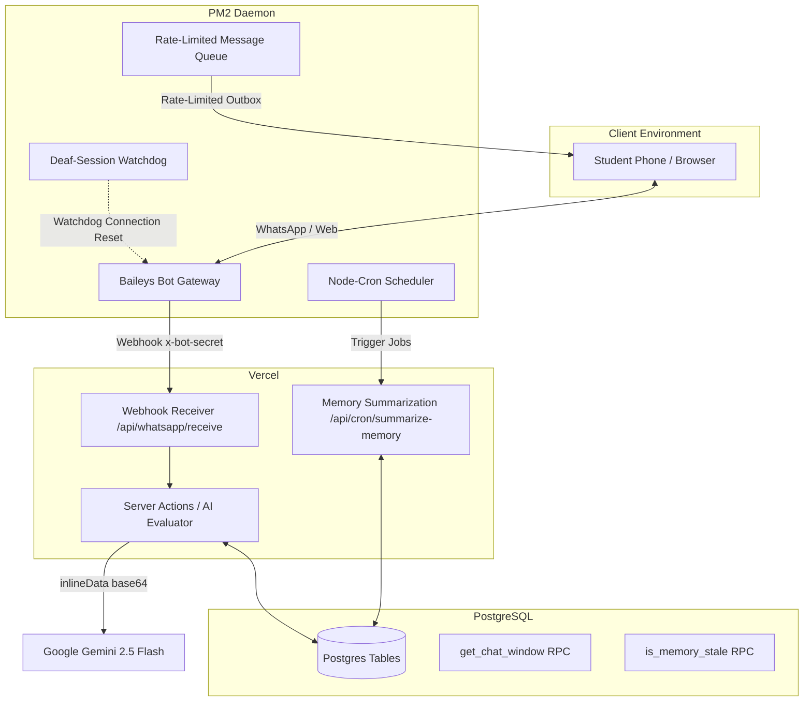

# LoopLearnX: Master Your Subjects with Adaptive Learning

<p align="center">
  <em>An intelligent educational platform designed to reinforce learning through spaced repetition, interactive quizzes, and personalized feedback.</em>
</p>

---

## 📖 Overview / Introduction

LoopLearnX is a modern educational application built to help students master subjects efficiently and counteract the natural "forgetting curve." Designed for both students and educators, it transforms traditional rote memorization into an engaging, continuous loop of improvement. 

**Who it's for:**
- **Students** looking for personalized study sessions, progress tracking, and supportive AI explanations.
- **Educators & Teachers** seeking insightful analytics to monitor their students' progress, identify knowledge gaps, and effortlessly generate educational content.

**The Problem It Solves:**
Traditional studying often leads to quick forgetting. LoopLearnX uses algorithmic question scheduling (Spaced Repetition System) to ensure you review material precisely when you're about to forget it, maximizing long-term retention. 

---

## ✨ Features

- **🤖 WhatsApp AI Tutor & Homework Automation**: Persistently connected Baileys-based WhatsApp bot (deployed on VPS via PM2) allowing students to submit homework as photos or text, ask doubts, and receive grading/feedback directly on their phones.
- **🧠 Three-Tier AI Tutor Memory System**: Features a Short-Term Sliding Window (last 6 messages) for real-time conversational flow, a Mid-Term Personalized Learning Profile (strengths, weaknesses, progress distilled nightly via Cron), and planned Long-Term Curriculum RAG.
- **🧠 Spaced Repetition System (SRS)**: Algorithmic scheduling of questions to maximize retention and minimize study time.
- **🔄 Non-Repetition Logic**: Smart session handling ensures students and guests don't see the same question twice in a single session.
- **📈 Personalized Learning & Profiles**: Dynamic difficulty adjustments, comprehensive student profiles, and interactive leaderboards for gamified learning.
- **🤖 AI-Powered Explanations & Evaluation**: Deep integration with **Google Gemini 2.5 Flash** for generating quiz questions, evaluating handwritten answer sheets via Vision, and providing on-demand tutor explanations.
- **📷 Handwritten Answer Grading (Vision AI)**: Students or teachers can upload a photo of a handwritten answer sheet. Gemini reads the handwriting and grades each question with per-question marks and detailed feedback.
- **📄 PDF Question Generation**: Teachers upload a chapter PDF and Gemini generates MCQ, Fill-in-the-Blank, or True/False questions grounded strictly in that content.
- **⚡ Quick Practice Sheet Scan**: Students write their own Q&A on paper, snap a photo, and Gemini auto-detects the class/subject/chapter and evaluates the whole sheet instantly — no teacher setup needed.
- **📚 Assignments with AI Grading**: Teachers upload a printed question paper (one or more images). Gemini extracts all questions, then grades each student's uploaded answer photos against those questions.
- **🌐 Hinglish Feedback Mode**: AI feedback can be delivered in Hinglish (Roman-script Hindi + English) for more relatable, student-friendly explanations.
- **📊 Comprehensive Teacher Dashboard**: Deep analytics for educators to track student accuracy, activity logs, and struggling areas.
- **⏱️ Universal Time Locks & Anti-Guessing**: Built-in 15-second time locks and forced reading time for incorrect answer explanations to reinforce genuine learning.
- **📝 Diverse Question Formats & Math Support**: True/False, Multiple Choice, Fill-in-the-Blanks, and advanced rendering for Math/LaTeX-based questions.
- **🔔 Notification System**: Real-time alerts to keep users informed about new activities and learning updates.
- **✨ Tolerant Answer Matching**: Built-in string similarity (fuzzy matching) algorithms for Fill-in-the-Blanks to gracefully handle minor typos.
- **📶 Offline Support (PWA)**: Integrated Service Worker allowing users to toggle offline mode and download quiz content locally.
- **📊 Google Analytics**: Built-in site tracking to monitor user engagement and traffic.

---

## 🏗️ Architecture / How It Works

LoopLearn is built as a multi-service ecosystem:



**High-Level Design:**
1. **Frontend (Client/Edge)**: Powered by **Next.js 15 (App Router)** and **React 19**. It provides a lightning-fast UI styled with **Tailwind CSS** and Radix UI components.
2. **Backend & Database**: **Supabase (PostgreSQL)** serves as the backbone for secure user authentication, storing educational content, tracking learning progress, and storing chat/memory tables.
3. **WhatsApp Bot Gateway**: Persistent daemon built on **Baileys (WA Multi-Device API)** running on a VPS. Manages connection sessions, checks for "deaf-session" bugs via a watchdog, handles file downloads, and schedules morning tasks/reminders.
4. **AI Integration**: The **Google Generative AI SDK** (`gemini-2.5-flash`) is called server-side for text generation, PDF/image multimodal evaluation, and on-demand tutoring.
5. **Offline Capability (PWA)**: Uses Service Workers and built-in caching APIs to provide an offline experience for studying without internet access.

---

## 🤖 AI Architecture & Gemini API Flows

All AI features are powered by `gemini-2.5-flash` via the Google Generative AI SDK and run as **Next.js Server Actions** (never on the client). Images and PDFs are passed as **base64-encoded `inlineData`** directly in the content array — no file uploads or cloud storage required for the AI call itself.

| Flow | Input | Output |
| :--- | :--- | :--- |
| **Text Question Generation** | Chapter name, subject, class, type | JSON array of questions |
| **PDF Question Generation** | Chapter PDF as `application/pdf` base64 | JSON array of questions grounded in the PDF |
| **Handwritten Answer Evaluation** | Student photo (`jpeg`/`png`/`webp`) as base64 | Per-question marks + feedback |
| **Quick Practice Sheet Scan** | Student's self-written Q&A photo | Auto-detects class/subject/chapter, then evaluates |
| **Assignment Paper Extraction** | Teacher's question paper (one or more images) | Structured question list with marks |
| **Assignment Answer Grading** | Extracted questions + student answer photos | Per-question marks, feedback, total score |

**Key implementation details:**
- Multi-page documents send each page as a **separate image part** in the same `generateContent` call.
- All responses are instructed to return **pure JSON** — any stray markdown wrappers (` ```json `) are stripped before parsing.
- Marks are **clamped to `[0, max]` and rounded to the nearest 0.5** (valid CBSE half-mark increments) after every evaluation.
- Feedback language is configurable: **English** (default) or **Hinglish** (Roman-script Hindi + English, zero Devanagari).

---

## 💬 WhatsApp AI Tutor & Three-Tier Memory System

To deliver a conversational, personalized tutor experience via WhatsApp, LoopLearn implements a dedicated agentic architecture integrated directly into the Gemini LLM pipeline.

### 1. Three-Tier Memory Model
* **Tier 1 — Short-Term (Sliding Conversational Window)**: Stores the rolling log of the last 6 messages per student in the `chat_messages` table. On every interaction, messages are fetched in chronological order using the PostgreSQL function `get_chat_window()` and injected directly into the prompt context to ensure conversation continuity.
* **Tier 2 — Mid-Term (Personalized Learning Profile)**: Stored in the `student_ai_memory` table. This contains bullet-point facts detailing student strengths, weaknesses, concepts mastered, and mistakes.
  * **Asynchronous Distillation**: Distilled daily by `/api/cron/summarize-memory` (running at 10 PM IST) to update the profiles without slowing down student chat latency.
  * **Lazy Safety Net**: If the profile is detected as older than 48 hours via `is_memory_stale()`, it is lazily updated inline on the hot path.
* **Tier 3 — Long-Term (Curriculum RAG - Planned)**: Grounding via textbook curriculum using `pgvector` stored in a `knowledge_base` table.

### 2. WhatsApp Bot Infrastructure (VPS Node App)
* **Deaf-Session Watchdog**: An internal check triggers a WebSocket reconnect if the Baileys connection appears online but fails to process incoming WhatsApp messages for more than 3 minutes.
* **Anti-Spam Rate-Limiter Outbox**: Messages queued for sending are dispatched with a randomized `1.5s - 3s` delay to prevent WhatsApp anti-spam flags.
* **Corrupt Character Filter**: Strips Devanagari script and complex emojis to prevent `???` characters on budget cell phones.
* **Cron Schedules (node-cron)**:
  * **7:00 AM (Mon-Sat)**: `7am_task` - sends morning homework assignments.
  * **5:00 PM (Mon-Sat)**: `5pm_reminder` - sends reminder alerts to pending students.
  * **8:00 PM (Mon-Sat)**: `8pm_flag` - flags non-submitting students as `missing` in database.
  * **8:15 PM (Mon-Sat)**: `8_15pm_eod_report` - delivers class performance summaries to teachers.
  * **Sunday 6:00 PM**: `sunday_weekly` - dispatches upcoming week's assignments to all students.

---

## 🚀 Installation / Setup Instructions

### 🌐 Next.js Web App (`looplearn-next`)
1. **Navigate to Directory**
   ```bash
   cd looplearn-next
   ```
2. **Install Dependencies**
   ```bash
   npm install
   ```
3. **Configure Environment Variables**
   Create a `.env.local` file in the root directory:
   ```env
   NEXT_PUBLIC_SUPABASE_URL=your_supabase_project_url
   NEXT_PUBLIC_SUPABASE_ANON_KEY=your_supabase_anon_key
   SUPABASE_SERVICE_ROLE_KEY=your_supabase_service_role_key
   GOOGLE_GEMINI_API_KEY=your_gemini_api_key
   WHATSAPP_BOT_SECRET=secure-shared-bot-secret
   CRON_SECRET=secure-cron-secret
   ```
4. **Run the Server**
   ```bash
   npm run dev
   ```

### 📱 WhatsApp Bot VPS Gateway (`looplearn-whatsapp-bot`)
1. **Navigate to Directory**
   ```bash
   cd looplearn-whatsapp-bot
   ```
2. **Install Dependencies**
   ```bash
   npm install
   ```
3. **Configure Environment Variables**
   Create a `.env` file in the directory:
   ```env
   LOOPLEARN_API_URL=your_nextjs_api_endpoint_url
   WHATSAPP_BOT_SECRET=secure-shared-bot-secret-matching-nextjs
   PORT=3000
   ```
4. **Start and Link Device**
   ```bash
   node index.js
   ```
   *Note: Access `http://localhost:3000` (or your VPS IP) and scan the QR code using WhatsApp Business under Linked Devices.*
5. **Manage with PM2 in Production**
   ```bash
   pm2 start index.js --name "looplearn-bot"
   pm2 save
   pm2 startup
   ```

---

## 🧪 Testing

LoopLearnX is equipped with robust tests covering spaced repetition logic and core utility functions using **Vitest**.

### Running Tests

To run the test suite, ensure your dependencies are installed, then execute:
```bash
npx vitest
```
Tests are located in the `src/__tests__` directory, ensuring our core algorithmic functions always perform accurately.

---

## 📖 Usage Guide

Getting started with LoopLearnX is straightforward for both guests and registered users.

**For Students:**
1. **Sign Up / Log In:** Create an account to unlock persistent progress tracking.
2. **Navigate Chapters:** From your Student Dashboard, select your class, subject (e.g., Science, Math), and chapter.
3. **Start a Quiz or Quick Practice:** Engage in a full Spaced Repetition study session or try the fast "Quick Practice" mode.
4. **Use Offline Mode:** Toggle the offline slider on your dashboard to download your pending questions and review them on the go.
5. **Check Analytics & Leaderboard:** Visit your profile to see your accuracy, position on the public leaderboard, and areas requiring more practice.

**For Teachers:**
1. **Access Teacher Dashboard:** Log in with an educator account.
2. **Monitor Students:** View leaderboards, check individual student progress, and identify struggling topics.
3. **Generate Content:** Use the PDF Upload capability to automatically create new quiz questions.
4. **Create Subjective Tests:** Distribute essay-style or open-ended tests that leverage AI for subjective evaluation and scoring.

---

## ⚙️ Configuration Options

LoopLearn relies on several environment variables for its core functionality:

### Web App Variables (`looplearn-next`)
| Variable | Description |
| :--- | :--- |
| `NEXT_PUBLIC_SUPABASE_URL` | Your Supabase project URL for database and auth connections. |
| `NEXT_PUBLIC_SUPABASE_ANON_KEY` | Public API key for accessing Supabase securely from the client. |
| `SUPABASE_SERVICE_ROLE_KEY` | High-privilege key to query profile and submission databases bypassing RLS on server endpoints. |
| `GOOGLE_GEMINI_API_KEY` | API key required to enable AI evaluations, memory distillations, and doubts. |
| `WHATSAPP_BOT_SECRET` | Shared authorization secret between Next.js and the VPS WhatsApp gateway. |
| `CRON_SECRET` | Header validation secret verifying Vercel Cron requests. |

### WhatsApp Bot Variables (`looplearn-whatsapp-bot`)
| Variable | Description |
| :--- | :--- |
| `LOOPLEARN_API_URL` | Next.js API root domain (e.g. `https://looplearnx.vercel.app`). |
| `WHATSAPP_BOT_SECRET` | Authorization secret matched with Next.js web application. |
| `PORT` | Local Express status and QR display web server port (default `3000`). |

---

## 📈 Data & Progress Tracking

**Why Logging In Matters:**
While LoopLearnX supports a robust guest mode, **creating an account is highly recommended**. 

- **Authenticated Users:** All your quiz results, accuracy metrics, and exact Spaced Repetition interval schedules are securely saved in our database. 
- **Guest Users:** Progress is saved temporarily in your browser's local storage. Great for a quick test drive, but clearing your cache will reset your learning loop.

---

## 🗺️ Roadmap / Future Plans

We are constantly iterating to make the learning loop even better:

- **Guest Migration Improvements:** Seamlessly transition your local guest progress into a permanent account upon signing up.
- **B2B Layer:** Enhanced institutional features for schools, complete with bulk student onboarding and class-wide analytics.
- **New Interactive Formats:** Gamified learning modes like Word Card matching and educational Hangman.
- **Advanced AI Study Plans:** Fully personalized, AI-generated weekly study agendas based on individual struggling areas.

---

## 🤝 Contributing Guidelines

We welcome contributions from developers, educators, and students! 

1. **Fork the Repository** on GitHub.
2. **Clone your fork** locally.
3. **Create a new branch** for your feature or bug fix (`git checkout -b feature/amazing-feature`).
4. **Commit your changes** clearly (`git commit -m "Add some amazing feature"`).
5. **Push to the branch** (`git push origin feature/amazing-feature`).
6. **Open a Pull Request**! We will review it, discuss potential changes, and merge it if it aligns with the project goals.

---

## 📄 License

This project is licensed under the **MIT License**. You are free to use, modify, and distribute it as per the terms of the license. See the `LICENSE` file for more details.

---

## 🙏 Acknowledgments / Credits

- Built with modern open-source powerhouses: **Next.js, React, Supabase, Tailwind CSS, and Google Gemini**.
- Special thanks to the "Lovable" design community for UX inspiration.
- Thank you to all the educators and students whose feedback continues to shape the LoopLearnX experience.

---

## 📞 Contact / Support

Have questions, feedback, or want to collaborate? Reach out!

- 📧 **Email**: [naveencg070@gmail.com](mailto:naveencg070@gmail.com)
- ✖️ **X (Twitter)**: [@NAVEENCGaur](https://x.com/NAVEENCGaur)
